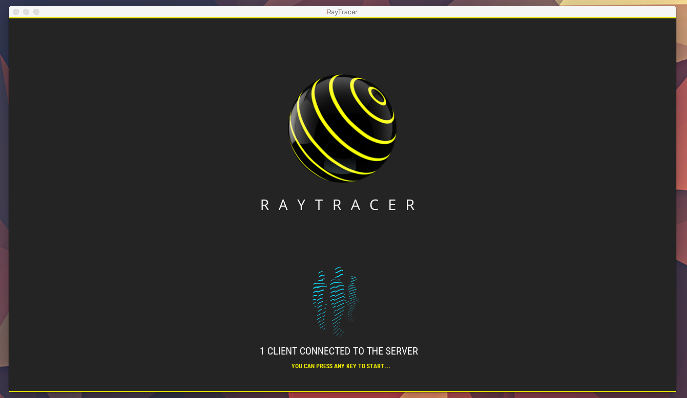
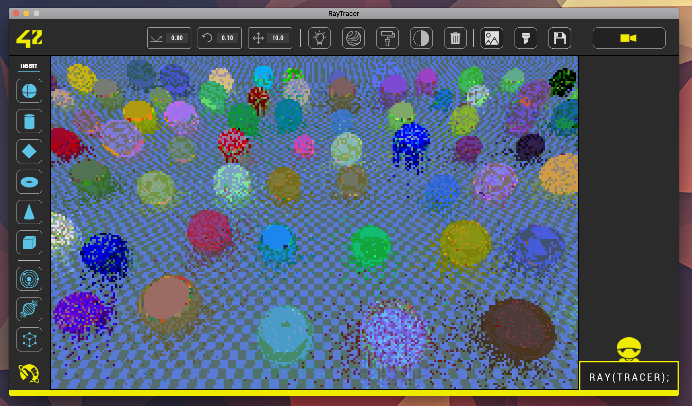
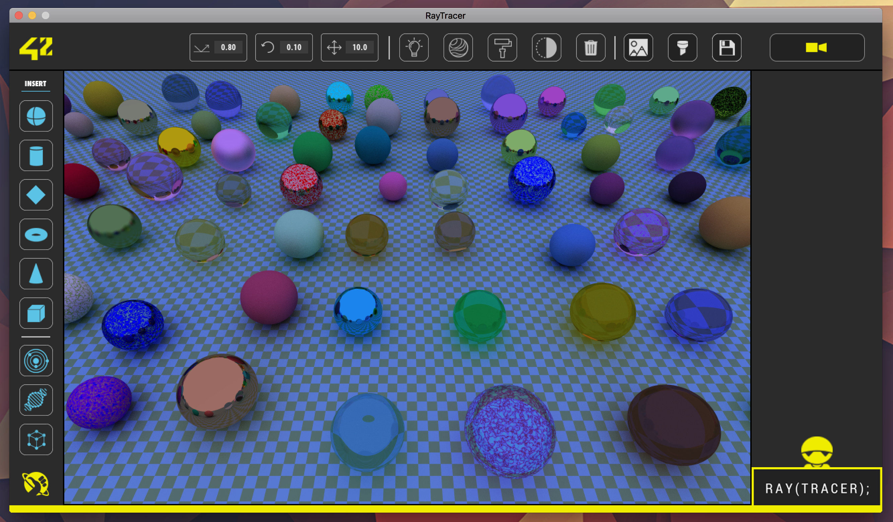
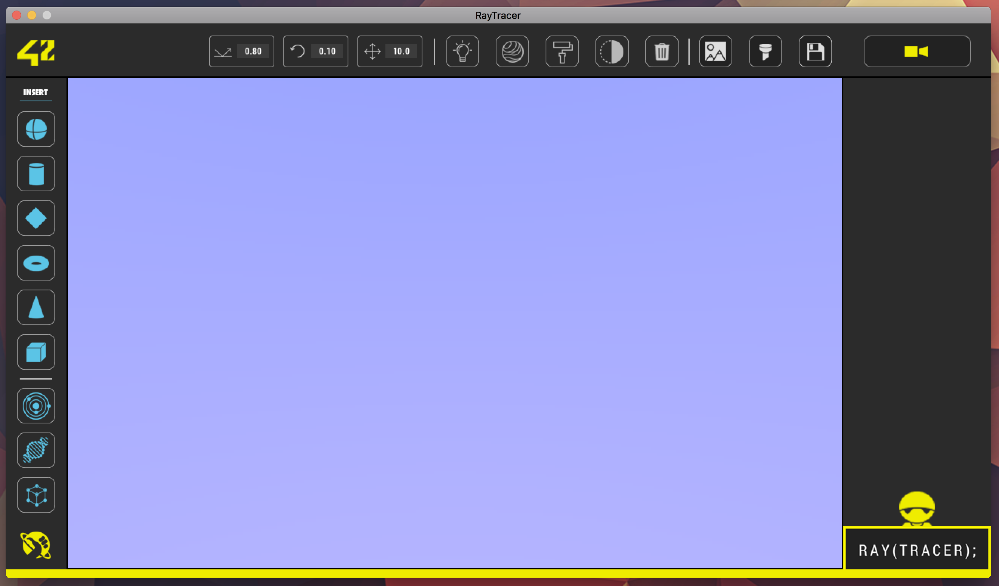
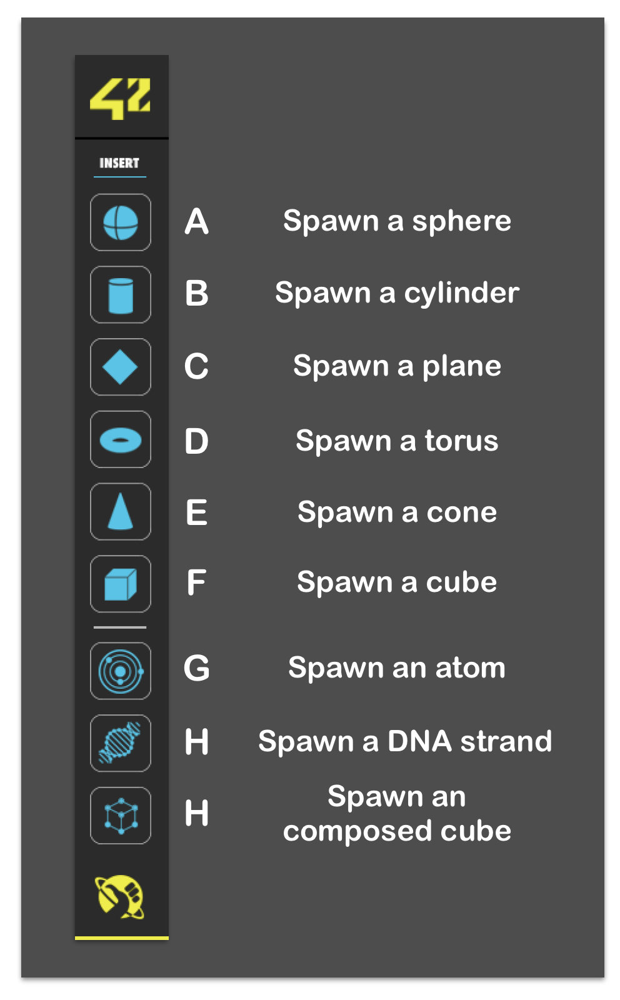
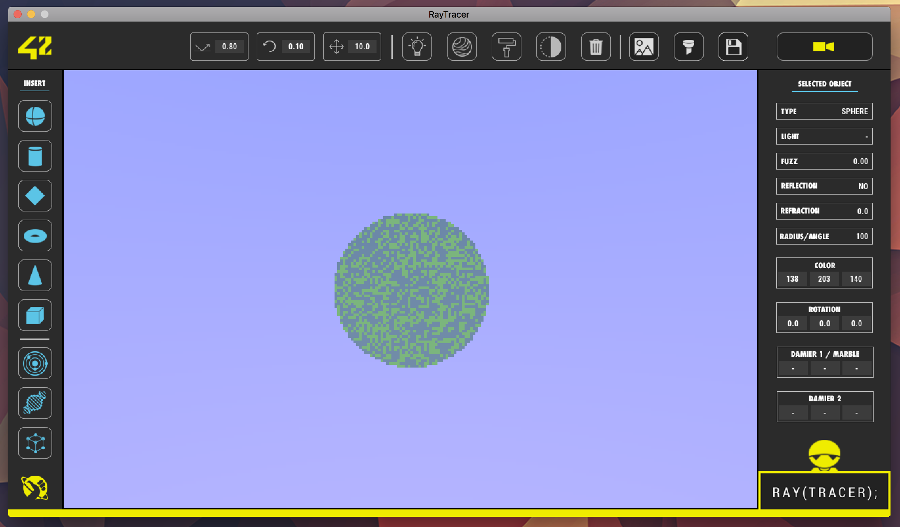
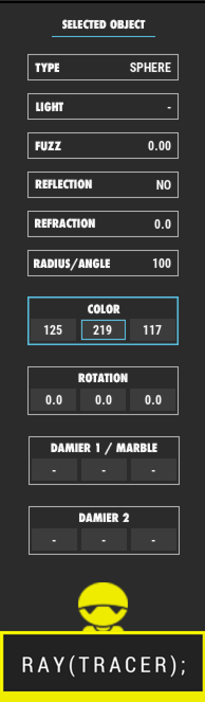
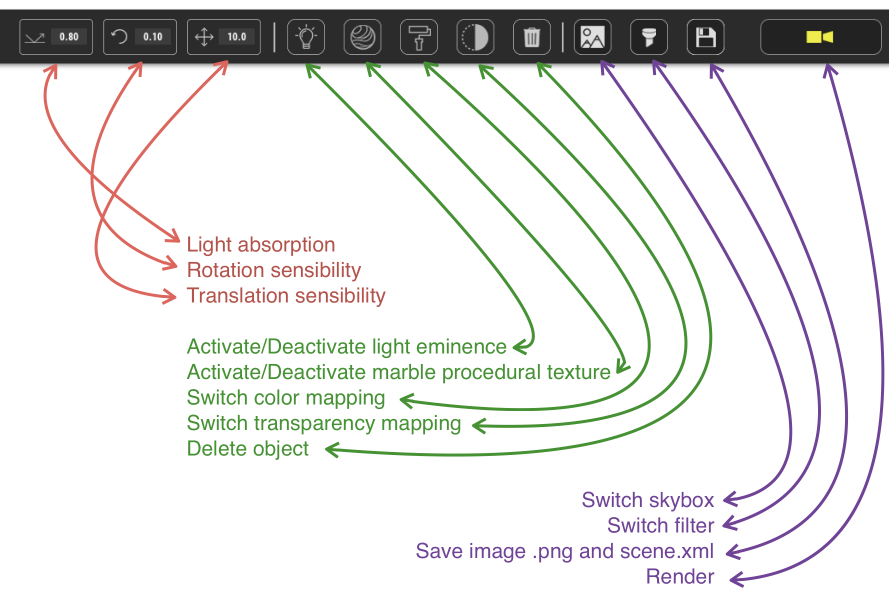
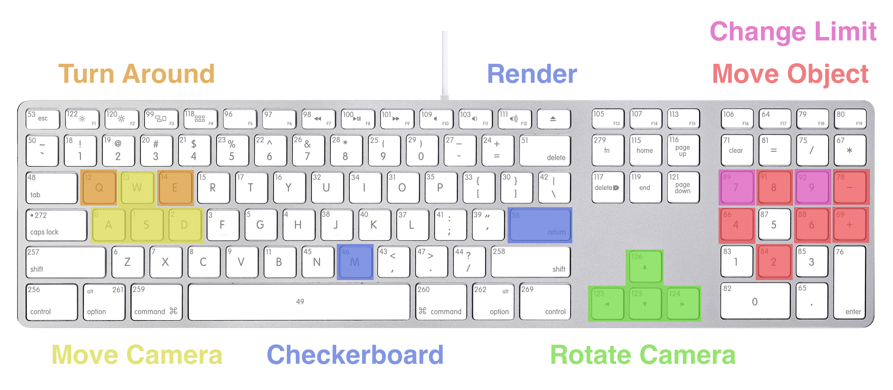

# Ray Tracer

Let's gear up! Following the [RTv1](http://github.com/nsampre/42/tree/rtv1) project, RT takes raytracing to a new level adding the mirror effect, transparency, object cutting, textures and more! Capitalize on your RTv1 project to create an infrastructure capable of managing all the ramifications of new features. Render outstanding computer-generated imagery sure to impress! Team up with your peers and practice the unavoidable future of working with others!


## Installation

```$ git clone http://github.com/nsampre/RT && cd ./RT && make```

/!\ By ~~lazyness~~ kindness we already compiled the SDL2, SDL_TTF and SDL_IMAGE frameworks in common/frameworks. Feel free to update them directly at www.libsdl.org . Oh by the way, this product was only tested for OSX users.

## Launch

This project is client-server oriented. However, you can launch the server directly with the embeded client. To do so :

```$ ./rt_server -p 1337```

The server will be listening on port 1337, the client will be automatically launched and a 'random' map will be generated.
If you a using a nice and old macbook air and you don't want your computer to burn, you might want to launch the server only and launch the server on your brand new $10K iMac Pro 18-cores.

```$ ./rt_server -p 1337 --not-local```

The server will hang until there is at least one client connected. To launch the client on your brand new $10K iMac Pro, then just execute :

```$ ./rt_client <your macbook air address> <1337 or the port you've defined>```

Nice, but it's the $10K iMac Pro's right to show what it's computing live !

```$ ./rt_client <your macbook air address> <1337 or the port you've defined> --win``` to show a nice little live computed frame to verify everything justs works fine.


Let's just go back to this command :

```./rt_server -p 1337```

If everything works fine, you should see this :



And the '1 client connected', meaning rt_server successfully forked and launched the rt_client on background. If not... make a 🎫.

Press a key, and TADAAAAM !



What ? Not sexy ? Blurry ? Weird ? It's the live edition mode. Just press enter or click on the 🎥 on the top right and wait a few seconds.



The first frame will always be noisy. Wait for the next frames to be added and averaged and it'll look smooth. If you like your image, you can save it by clicking on the save button [11]. It will save the image on a .png format in ./images/ and the current scene description on an .xml format in ./scenes/.

Not sexy enought ? OK. I get it. Let's make your own scene then.


## Live Scene Editor

First of all let's start from scratch with something empty.

```./rt_server -p 1337 ./scenes/void.xml```



Let's add a sphere, click on the sphere[A] button





The right menu popped, describing the selected object. To select an object, just click on one.





Now, time for you to get some fun.

